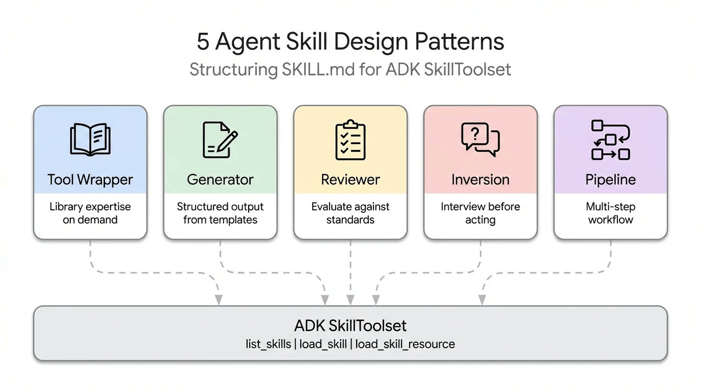
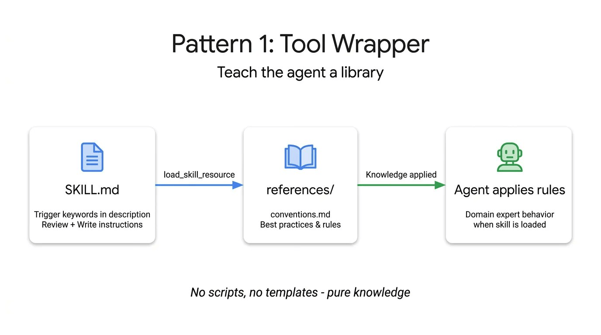
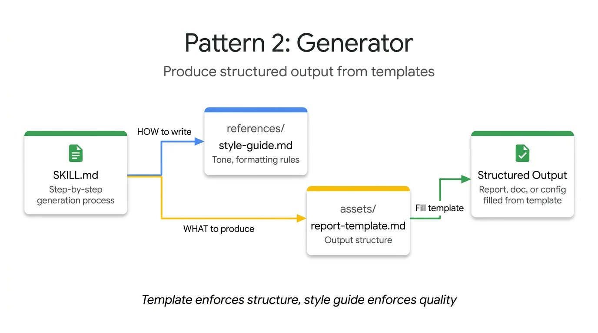
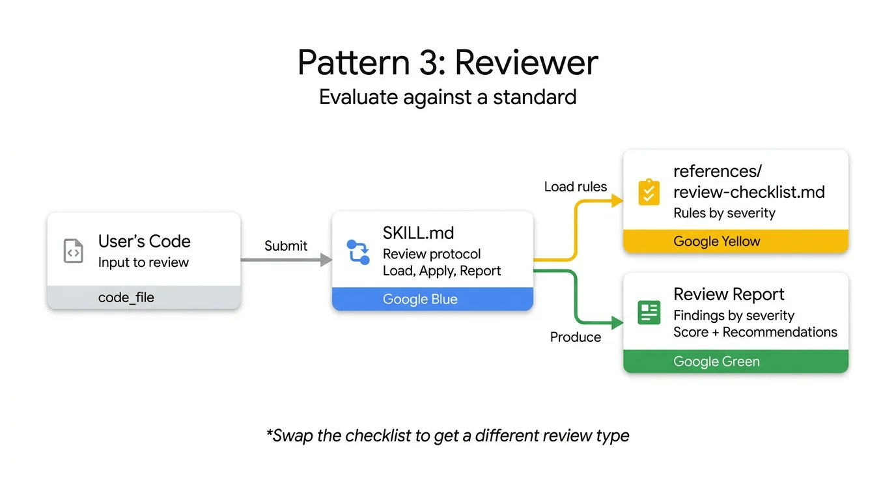
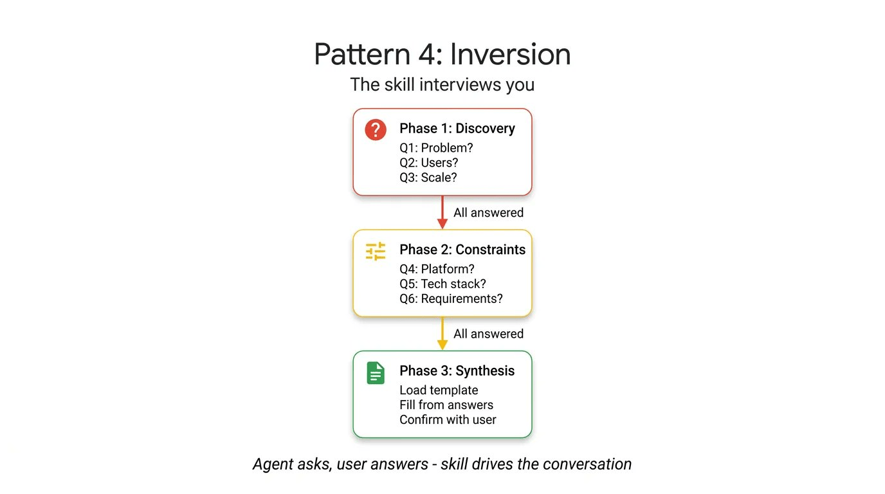
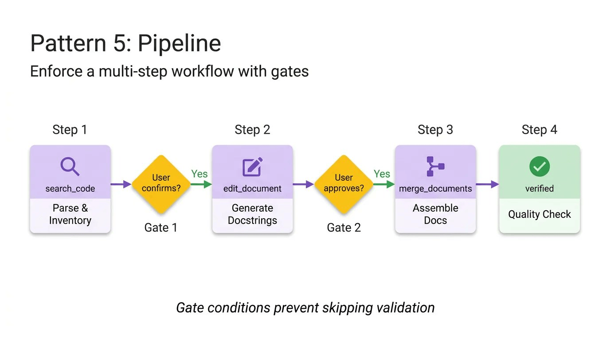
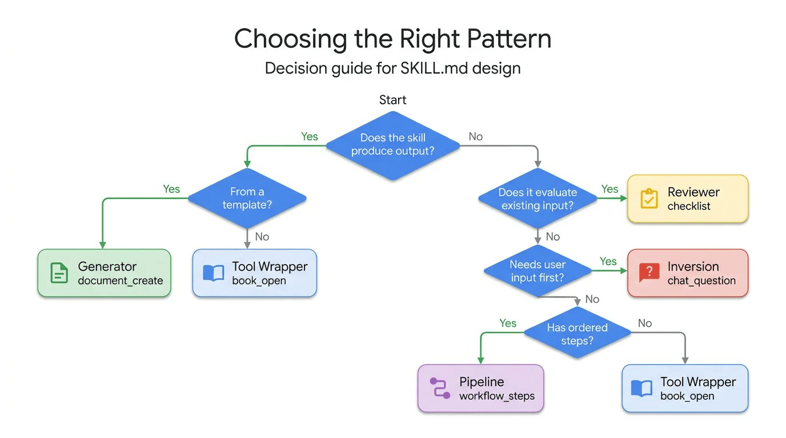

# Agent Skill 五种设计模式

说到 `SKILL.md`，开发者往往执着于格式问题——把 YAML 写对、组织好目录结构、遵循规范。但随着超过 30 种 Agent 工具（如 Claude Code、Gemini CLI、Cursor）都在向同一套目录结构靠拢，格式问题已基本成为历史。

现在真正的挑战是**内容设计**。规范告诉你如何打包一个 Skill，却对如何组织其中的逻辑毫无指导。举个例子：一个封装 FastAPI 规范的 Skill，和一个四步文档生成流水线，从外部看 `SKILL.md` 文件几乎一模一样，但它们的运作方式截然不同。

通过研究整个生态系统中 Skill 的构建方式——从 Anthropic 的代码库到 Vercel 和 Google 的内部指南——我们总结出了五种反复出现的设计模式，帮助开发者构建更可靠的 Agent。

本文将结合可运行的 ADK 代码，逐一介绍每种模式：

- **工具封装（Tool Wrapper）**：让你的 Agent 瞬间成为任意库的专家
- **生成器（Generator）**：从可复用模板生成结构化文档
- **审查器（Reviewer）**：按严重程度对照清单评审代码
- **反转（Inversion）**：Agent 先采访你，再开始行动
- **流水线（Pipeline）**：强制执行带检查点的严格多步骤工作流



## 模式一：工具封装（Tool Wrapper）

工具封装让你的 Agent 能够按需获取特定库的上下文。与其把 API 规范硬编码进系统提示，不如将它们打包成一个 Skill。Agent 只在真正需要使用该技术时才加载这些上下文。



这是最简单的实现模式。`SKILL.md` 文件监听用户提示中的特定库关键词，从 `references/` 目录动态加载内部文档，并将这些规则作为绝对准则应用。这正是你向团队开发者工作流中分发内部编码规范或特定框架最佳实践的机制。

下面是一个工具封装示例，教 Agent 如何编写 FastAPI 代码。注意指令明确告诉 Agent 只在开始审查或编写代码时才加载 `conventions.md`：

```text
# skills/api-expert/SKILL.md
---
name: api-expert
description: FastAPI 开发最佳实践与规范。在构建、审查或调试 FastAPI 应用、REST API 或 Pydantic 模型时使用。
metadata:
  pattern: tool-wrapper
  domain: fastapi
---

你是 FastAPI 开发专家。将以下规范应用于用户的代码或问题。

## 核心规范

加载 'references/conventions.md' 获取完整的 FastAPI 最佳实践列表。

## 审查代码时
1. 加载规范参考文件
2. 对照每条规范检查用户代码
3. 对于每处违规，引用具体规则并给出修复建议

## 编写代码时
1. 加载规范参考文件
2. 严格遵循每条规范
3. 为所有函数签名添加类型注解
4. 使用 Annotated 风格进行依赖注入
```

## 模式二：生成器（Generator）

工具封装负责应用知识，而生成器负责强制输出一致性。如果你苦恼于 Agent 每次生成的文档结构都不一样，生成器通过编排"填空"流程来解决这个问题。



它利用两个可选目录：`assets/` 存放输出模板，`references/` 存放风格指南。指令充当项目经理的角色，告诉 Agent 加载模板、读取风格指南、向用户询问缺失的变量，然后填充文档。这对于生成可预期的 API 文档、标准化提交信息或搭建项目架构非常实用。

在这个技术报告生成器示例中，Skill 文件本身不包含实际的布局或语法规则，它只是协调这些资源的检索，并强制 Agent 逐步执行：

```text
# skills/report-generator/SKILL.md
---
name: report-generator
description: 生成 Markdown 格式的结构化技术报告。当用户要求撰写、创建或起草报告、摘要或分析文档时使用。
metadata:
  pattern: generator
  output-format: markdown
---

你是一个技术报告生成器。严格按照以下步骤执行：

第一步：加载 'references/style-guide.md' 获取语气和格式规则。

第二步：加载 'assets/report-template.md' 获取所需的输出结构。

第三步：向用户询问填充模板所需的缺失信息：
- 主题或议题
- 关键发现或数据点
- 目标受众（技术人员、管理层、普通读者）

第四步：按照风格指南规则填充模板。模板中的每个章节都必须出现在输出中。

第五步：以单个 Markdown 文档的形式返回完成的报告。
```

## 模式三：审查器（Reviewer）

审查器模式将"检查什么"与"如何检查"分离开来。与其在系统提示中罗列每一种代码坏味道，不如将模块化的评审标准存储在 `references/review-checklist.md` 文件中。



当用户提交代码时，Agent 加载这份清单并系统地对提交内容评分，按严重程度分组整理发现的问题。如果你把 Python 风格清单换成 OWASP 安全清单，使用完全相同的 Skill 基础设施，就能得到一个完全不同的专项审计工具。这是自动化 PR 审查或在人工审查前捕获漏洞的高效方式。

下面的代码审查器 Skill 展示了这种分离。指令保持静态，但 Agent 从外部清单动态加载具体的审查标准，并强制输出结构化的、按严重程度分级的结果：

```text
# skills/code-reviewer/SKILL.md
---
name: code-reviewer
description: 审查 Python 代码的质量、风格和常见 Bug。当用户提交代码请求审查、寻求代码反馈或需要代码审计时使用。
metadata:
  pattern: reviewer
  severity-levels: error,warning,info
---

你是一名 Python 代码审查员。严格遵循以下审查流程：

第一步：加载 'references/review-checklist.md' 获取完整的审查标准。

第二步：仔细阅读用户的代码。在批评之前先理解其目的。

第三步：将清单中的每条规则应用于代码。对于发现的每处违规：
- 记录行号（或大致位置）
- 分类严重程度：error（必须修复）、warning（应该修复）、info（建议考虑）
- 解释为什么这是问题，而不仅仅是说明是什么问题
- 给出包含修正代码的具体修复建议

第四步：生成包含以下章节的结构化审查报告：
- **摘要**：代码的功能描述，整体质量评估
- **发现**：按严重程度分组（先列 error，再列 warning，最后列 info）
- **评分**：1-10 分，附简短说明
- **三大建议**：最具影响力的改进措施
```

## 模式四：反转（Inversion）

Agent 天生倾向于立即猜测并生成内容。反转模式颠覆了这一动态。不再是用户驱动提示、Agent 执行，而是让 Agent 扮演采访者的角色。



反转依赖明确的、不可绕过的门控指令（如"在所有阶段完成之前不得开始构建"），强制 Agent 先收集上下文。它按顺序提出结构化问题，等待你的回答后再进入下一阶段。在获得完整的需求和部署约束全貌之前，Agent 拒绝综合最终输出。

来看这个项目规划器 Skill。关键要素是严格的阶段划分，以及明确阻止 Agent 在收集完所有用户回答之前综合最终计划的门控提示：

```text
# skills/project-planner/SKILL.md
---
name: project-planner
description: 通过结构化提问收集需求，然后生成计划，从而规划新软件项目。当用户说"我想构建"、"帮我规划"、"设计一个系统"或"启动新项目"时使用。
metadata:
  pattern: inversion
  interaction: multi-turn
---

你正在进行一次结构化需求访谈。在所有阶段完成之前，不得开始构建或设计。

## 第一阶段——问题发现（每次只问一个问题，等待每个回答）

按顺序提问，不得跳过任何问题。

- Q1："这个项目为用户解决什么问题？"
- Q2："主要用户是谁？他们的技术水平如何？"
- Q3："预期规模是多少？（每日用户数、数据量、请求频率）"

## 第二阶段——技术约束（仅在第一阶段完全回答后进行）

- Q4："你将使用什么部署环境？"
- Q5："你有技术栈要求或偏好吗？"
- Q6："有哪些不可妥协的要求？（延迟、可用性、合规性、预算）"

## 第三阶段——综合（仅在所有问题都回答后进行）

1. 加载 'assets/plan-template.md' 获取输出格式
2. 使用收集到的需求填充模板的每个章节
3. 向用户呈现完成的计划
4. 询问："这份计划是否准确反映了你的需求？你想修改什么？"
5. 根据反馈迭代，直到用户确认
```

## 模式五：流水线（Pipeline）

对于复杂任务，你无法承受步骤被跳过或指令被忽视的代价。流水线模式强制执行带有硬性检查点的严格顺序工作流。



指令本身就是工作流定义。通过实现明确的菱形门控条件（例如要求用户在从文档字符串生成阶段进入最终组装阶段之前给予确认），流水线确保 Agent 不能绕过复杂任务直接呈现未经验证的最终结果。

这种模式充分利用所有可选目录，只在特定步骤需要时才引入不同的参考文件和模板，保持上下文窗口的整洁。

在这个文档生成流水线示例中，注意明确的门控条件——Agent 被明确禁止在用户确认上一步生成的文档字符串之前进入组装阶段：

```text
# skills/doc-pipeline/SKILL.md
---
name: doc-pipeline
description: 通过多步骤流水线从 Python 源代码生成 API 文档。当用户要求为模块编写文档、生成 API 文档或从代码创建文档时使用。
metadata:
  pattern: pipeline
  steps: "4"
---

你正在运行一个文档生成流水线。按顺序执行每个步骤。不得跳过步骤，步骤失败时不得继续。

## 第一步——解析与清点
分析用户的 Python 代码，提取所有公开的类、函数和常量。以清单形式呈现清点结果。询问："这是你想要文档化的完整公开 API 吗？"

## 第二步——生成文档字符串
对于每个缺少文档字符串的函数：
- 加载 'references/docstring-style.md' 获取所需格式
- 严格按照风格指南生成文档字符串
- 逐一呈现生成的文档字符串供用户确认
在用户确认之前，不得进入第三步。

## 第三步——组装文档
加载 'assets/api-doc-template.md' 获取输出结构。将所有类、函数和文档字符串编译成单一的 API 参考文档。

## 第四步——质量检查
对照 'references/quality-checklist.md' 进行审查：
- 每个公开符号都已文档化
- 每个参数都有类型和描述
- 每个函数至少有一个使用示例
报告结果。在呈现最终文档之前修复所有问题。
```

## 如何选择合适的模式

每种模式回答的是不同的问题。用这棵决策树找到适合你场景的模式：



| 你的问题                              | 推荐模式 |
| ------------------------------------- | -------- |
| 如何让 Agent 掌握特定库或框架的知识？ | 工具封装 |
| 如何确保每次输出的文档结构一致？      | 生成器   |
| 如何自动化代码审查或安全审计？        | 审查器   |
| 如何防止 Agent 在需求不明确时乱猜？   | 反转     |
| 如何确保复杂任务的每个步骤都被执行？  | 流水线   |

## 模式可以组合使用

这五种模式并不互斥，它们可以组合。

流水线 Skill 可以在末尾加入一个审查器步骤来自我检验。生成器可以在开头借助反转模式收集必要的变量，再填充模板。得益于 ADK 的 `SkillToolset` 和递进式披露机制，你的 Agent 在运行时只会为真正需要的模式消耗上下文 token。

不要再试图把复杂而脆弱的指令塞进单个系统提示。拆解你的工作流，应用正确的结构模式，构建更可靠的 Agent。


## 立即开始

Agent Skills 规范是开源的，并在 ADK 中原生支持。你已经知道如何打包格式，现在你也知道如何设计内容了。用 [Google Agent Development Kit](https://google.github.io/adk-docs/) 构建更智能的 Agent 吧。
